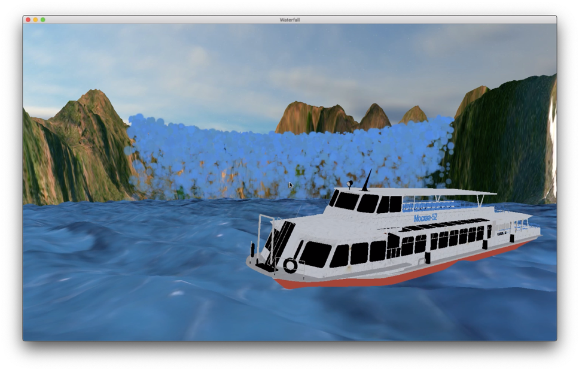
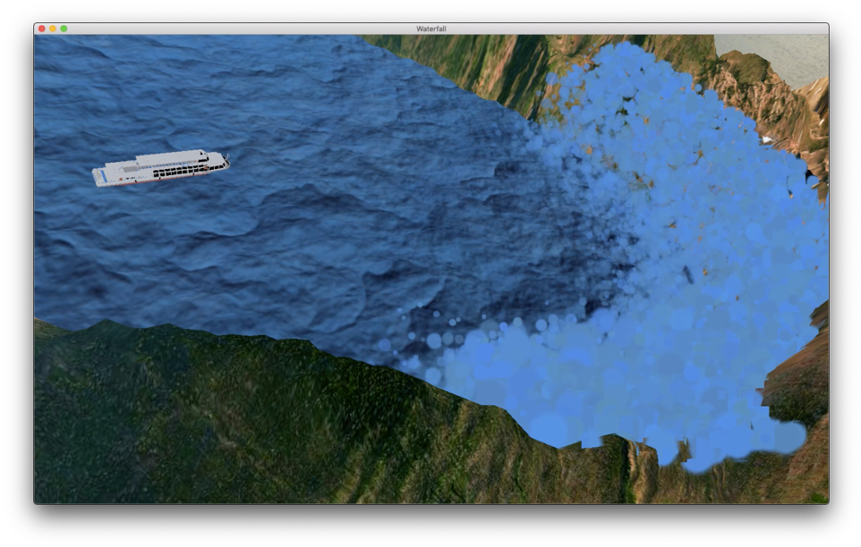
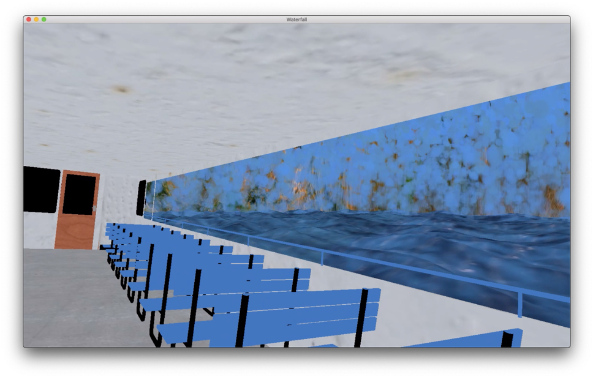
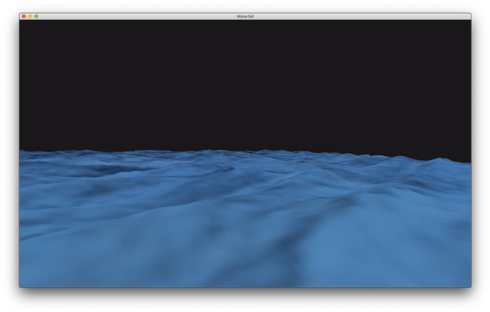

# Waterfall-Rendering
使用OpenGL实现的半环状瀑布动态场景，支持视角的移动。基于Mac OSX & Xcode & C++实现。


### 需要的库
GLFW: **G**raphics **L**ibrary **F**rame**w**ork--创建并管理窗口和 OpenGL 上下文

GLEW:  Open**GL** **E**xtension **W**rangler Library--基于OpenGL图形接口的跨平台C++扩展库

glm: Open**GL** **M**athematics--OpenGL数学计算扩展库

assimp: Open **As**set **Imp**ort Library--导入模型文件的扩展库

*注：Mac OSX 可以直接用brew安装上述各库，使用Xcode加载项目后，修改Scheme的Build路径，即可直接编译运行；Windows使用Visual Studio配置各库并设置链接到项目里后即可直接运行。*


### 实现效果

1. 包含元素

   飞流而下的瀑布、环形山脉、起伏的水面、可移动的船、天空盒


2. 效果图

   水平面视角




​	俯视视角




​	船内视角



​	

​	水面部分截取




### TODOs

```
船随水面起伏的运动
水雾
山模型的修正
camera的固定
调参（颜色，位置，速度）
```